# Hướng dẫn sử dụng — Module Kinh doanh (Sales / CRM)

> Tài liệu dành cho người dùng cuối (nhân viên & trưởng nhóm kinh doanh) của hệ thống HRM.
> Ảnh minh họa được chụp trực tiếp từ hệ thống thực tế.
> Phiên bản: SPEC-045 · Cập nhật: 30/06/2026

---

## Mục lục

1. [Giới thiệu](#1-giới-thiệu)
2. [Truy cập module](#2-truy-cập-module)
3. [Tổng quan bán hàng (Dashboard)](#3-tổng-quan-bán-hàng-dashboard)
4. [Quản lý khách hàng & lead](#4-quản-lý-khách-hàng--lead)
5. [Lead Pool & phân công](#5-lead-pool--phân-công)
6. [Vòng đời khách hàng (lifecycle)](#6-vòng-đời-khách-hàng-lifecycle)
7. [Nhập khách hàng từ file](#7-nhập-khách-hàng-từ-file)
8. [Hoạt động & ghi chú](#8-hoạt-động--ghi-chú)
9. [Công ty (khách hàng B2B)](#9-công-ty-khách-hàng-b2b)
10. [Pipeline & cơ hội bán hàng](#10-pipeline--cơ-hội-bán-hàng)
11. [Báo giá & sản phẩm](#11-báo-giá--sản-phẩm)
12. [Việc cần làm (follow-up)](#12-việc-cần-làm-follow-up)
13. [Gửi email cho khách hàng](#13-gửi-email-cho-khách-hàng)
14. [Cấu hình (Cài đặt bán hàng)](#14-cấu-hình-cài-đặt-bán-hàng)
15. [Phân quyền](#15-phân-quyền)

---

## 1. Giới thiệu

Module **Kinh doanh (Sales / CRM)** giúp đội ngũ bán hàng quản lý toàn bộ quy trình từ
khách hàng tiềm năng đến khi chốt hợp đồng:

- **Khách hàng / Lead** — lưu thông tin, theo dõi vòng đời, chống trùng.
- **Cơ hội bán hàng (Deal)** — theo dõi từng thương vụ qua pipeline kéo-thả.
- **Sản phẩm & Báo giá** — lập báo giá nhiều dòng, giá trị cơ hội tự tính.
- **Việc cần làm** — nhắc lịch follow-up tự động.
- **Email** — gửi email cho khách kèm mẫu, lưu lịch sử.
- **Báo cáo** — dashboard hiệu suất theo vai trò.

Hệ thống hỗ trợ cả **B2B** (bán cho doanh nghiệp) lẫn **B2C** (bán cho cá nhân).

> **Hai khái niệm cần phân biệt:**
> - **Trạng thái khách hàng (lifecycle):** *"Khách này có đáng theo đuổi không?"* — Mới → Đã liên hệ → Đủ điều kiện → … → Khách hàng / Loại.
> - **Giai đoạn cơ hội (stage):** *"Một thương vụ cụ thể đang ở đâu?"* — Mới → Báo giá → Đàm phán → Thắng / Thua.
> Một khách hàng có thể có **nhiều cơ hội** chạy song song.

---

## 2. Truy cập module

Sau khi đăng nhập, các chức năng kinh doanh nằm ở nhóm **KINH DOANH** trên thanh menu bên trái.
Phần cấu hình nằm ở **Cài đặt bán hàng** trong nhóm **HỆ THỐNG**.

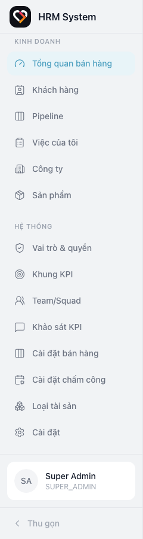

| Mục | Chức năng |
|-----|-----------|
| **Tổng quan bán hàng** | Dashboard số liệu & biểu đồ |
| **Khách hàng** | Danh sách & quản lý khách hàng/lead |
| **Pipeline** | Bảng Kanban cơ hội bán hàng |
| **Việc của tôi** | Việc follow-up được giao |
| **Công ty** | Quản lý công ty (khách hàng B2B) |
| **Sản phẩm** | Danh mục sản phẩm/dịch vụ |
| **Cài đặt bán hàng** | Cấu hình giai đoạn pipeline & mẫu email |

> Các mục hiển thị tùy theo **quyền** của tài khoản (xem [mục 15](#15-phân-quyền)).

---

## 3. Tổng quan bán hàng (Dashboard)

Vào **Tổng quan bán hàng** để xem nhanh hiệu suất kinh doanh.

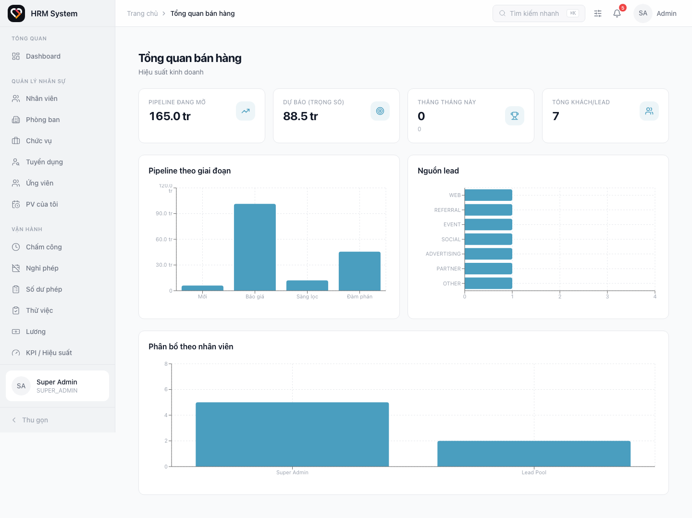

- **4 thẻ số liệu:** Pipeline đang mở (tổng giá trị cơ hội), Dự báo (trọng số = giá trị × xác suất giai đoạn), Thắng tháng này, Tổng khách/lead.
- **Pipeline theo giai đoạn:** giá trị cơ hội ở mỗi giai đoạn.
- **Nguồn lead:** khách hàng đến từ kênh nào.
- **Phân bổ theo nhân viên** *(chỉ trưởng nhóm/quản lý thấy):* số khách mỗi nhân viên đang phụ trách.

> Nhân viên kinh doanh chỉ thấy số liệu **của mình**; trưởng nhóm/quản lý thấy **toàn nhóm**.

---

## 4. Quản lý khách hàng & lead

Vào **Khách hàng** để xem danh sách. Có thể tìm kiếm (theo tên/email/SĐT) và lọc theo
loại, trạng thái, người phụ trách.

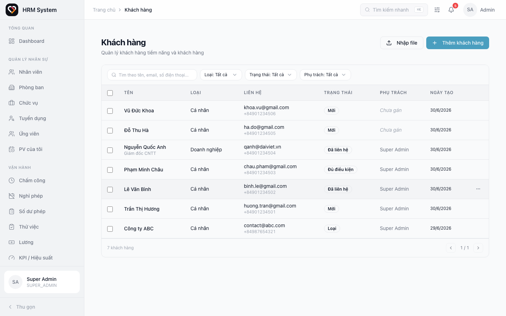

**Thêm khách hàng mới:** nhấn **+ Thêm khách hàng** ở góc trên phải.

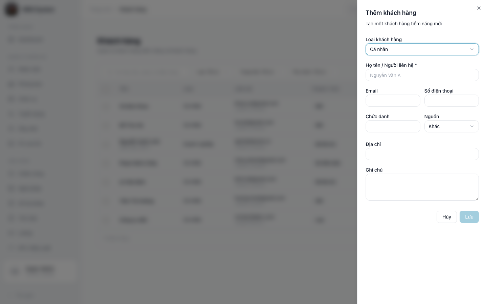

- **Loại khách hàng:** *Cá nhân* (B2C) hoặc *Doanh nghiệp* (B2B). Chọn Doanh nghiệp sẽ
  hiện ô **Công ty** để gắn (hoặc tạo nhanh công ty mới — xem [mục 9](#9-công-ty-khách-hàng-b2b)).
- **Số điện thoại** tự chuẩn hóa về dạng `+84…`.
- Hệ thống **tự chống trùng**: nếu email/SĐT đã tồn tại, sẽ cảnh báo và gợi ý mở khách hàng cũ.

**Xem chi tiết:** nhấn vào một dòng để mở trang chi tiết với các tab Thông tin · Hoạt động ·
Cơ hội · Báo giá · Email · Việc cần làm.

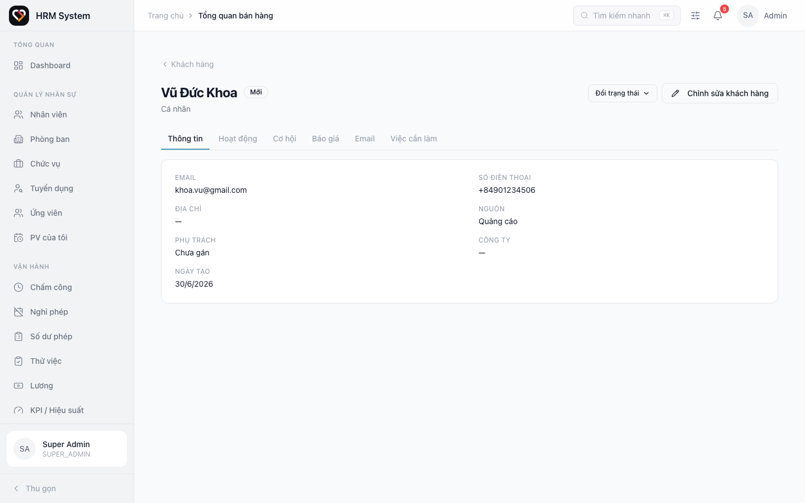

---

## 5. Lead Pool & phân công

**Lead Pool** là nơi chứa các khách hàng **chưa có ai phụ trách** (cột *Phụ trách* hiển thị "Chưa gán").

- **Nhận lead:** mở menu **⋯** ở cuối dòng → **Nhận lead** để tự nhận về mình.
- **Phân công / chuyển phụ trách:** (trưởng nhóm/quản lý) menu **⋯** → **Phân công**, chọn người phụ trách.
- **Phân công hàng loạt:** tích chọn nhiều dòng (cột checkbox bên trái) → thanh thao tác hiện ở
  cuối màn hình → **Phân công**.

> Mọi thay đổi người phụ trách đều được ghi lại trong tab **Hoạt động** của khách hàng.

---

## 6. Vòng đời khách hàng (lifecycle)

Tại trang chi tiết khách hàng, nhấn **Đổi trạng thái** để cập nhật vòng đời:

`Mới → Đã liên hệ → Đủ điều kiện → Đã tạo cơ hội → Khách hàng` (hoặc nhánh **Loại**).

- Khi chọn **Loại**, hệ thống **bắt buộc nhập lý do** (vd: ngân sách không đủ, chọn đối thủ…).
- Khi một cơ hội được đánh dấu **Thắng**, khách hàng tự chuyển thành **Khách hàng**.

---

## 7. Nhập khách hàng từ file

Nhấn **Nhập file** ở trang Khách hàng để nạp danh sách lớn.

1. **Tải file mẫu** (.xlsx/.csv) và điền dữ liệu.
2. **Chọn file** để tải lên — hệ thống kiểm tra trước (preview): số dòng hợp lệ / bị bỏ qua kèm lý do (thiếu tên, trùng…).
3. Nhấn **Nhập** để xác nhận. Khách hàng nhập vào sẽ nằm ở **Lead Pool** để phân công sau.

---

## 8. Hoạt động & ghi chú

Tab **Hoạt động** trên trang chi tiết là dòng thời gian đầy đủ: ghi chú thủ công + các sự kiện
hệ thống tự ghi (đổi giai đoạn, đổi phụ trách, đổi trạng thái, gửi email…).

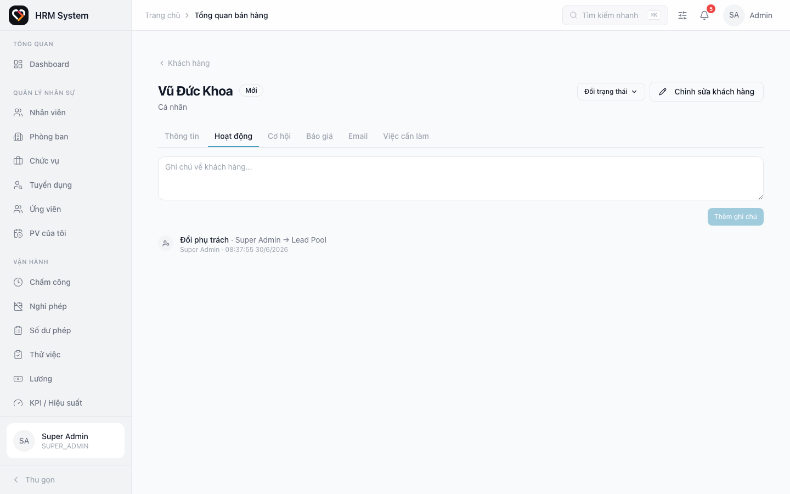

Nhập nội dung vào ô và nhấn **Thêm ghi chú** để lưu lại lịch sử chăm sóc khách.

---

## 9. Công ty (khách hàng B2B)

Vào **Công ty** để quản lý các tổ chức. Mỗi công ty có thể gắn **nhiều người liên hệ** (khách hàng B2B).

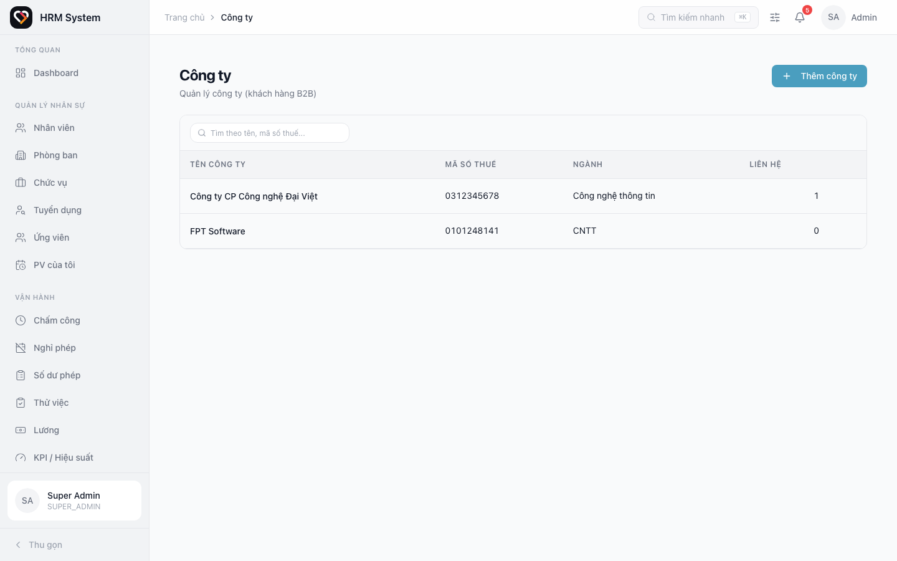

- Thông tin: tên, mã số thuế, ngành nghề, quy mô, website, địa chỉ.
- Cột **Liên hệ** cho biết số khách hàng đang gắn với công ty đó.
- Khi tạo khách hàng B2B, có thể **tạo nhanh công ty ngay trong form** mà không cần rời màn hình.

---

## 10. Pipeline & cơ hội bán hàng

Vào **Pipeline** để quản lý cơ hội theo bảng Kanban. Mỗi cột là một **giai đoạn**, mỗi thẻ là một **cơ hội**.

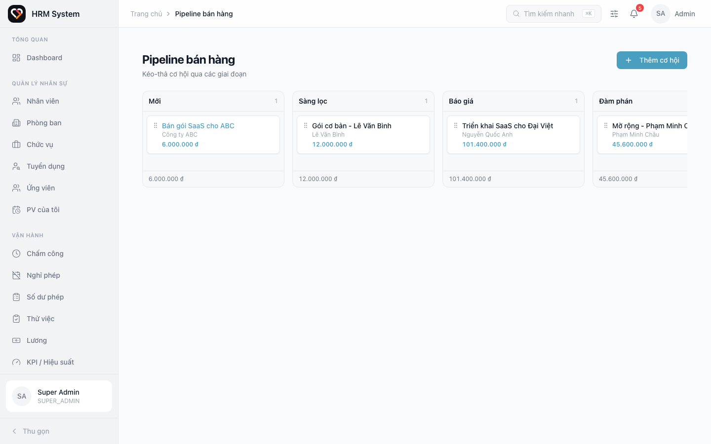

- **Tạo cơ hội:** nhấn **+ Thêm cơ hội**, chọn khách hàng và đặt tên.
- **Chuyển giai đoạn:** **kéo-thả** thẻ sang cột khác. Hệ thống ghi lại lịch sử mỗi lần chuyển.
- Kéo thẻ vào cột **Thắng** → đánh dấu thắng; vào cột **Thua** → yêu cầu nhập lý do thua.
- Mỗi cột hiển thị **số lượng** và **tổng giá trị** cơ hội.

**Xem chi tiết cơ hội:** nhấn vào thẻ để mở bảng chi tiết — thông tin, nút **Thắng/Thua**, và quản lý báo giá.

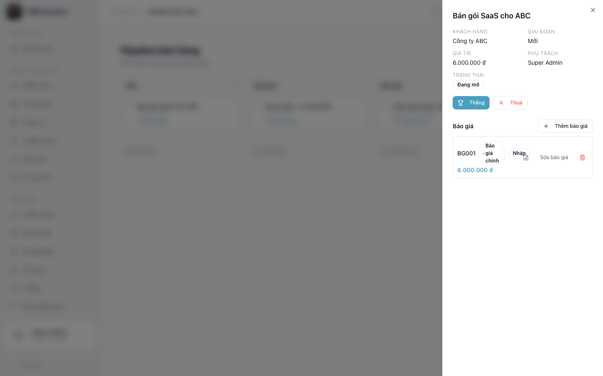

---

## 11. Báo giá & sản phẩm

**Danh mục sản phẩm** (menu **Sản phẩm**): khai báo sản phẩm/dịch vụ với SKU, đơn giá, đơn vị tính.

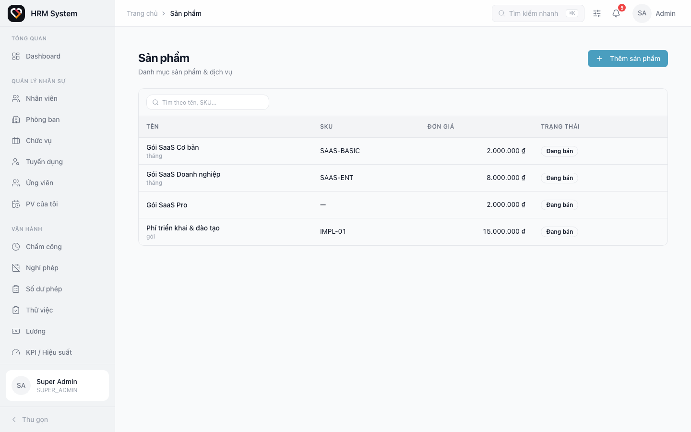

> Sản phẩm đã dùng trong báo giá không thể xóa — hãy **lưu trữ** (archive) thay thế.

**Lập báo giá** (trong bảng chi tiết cơ hội → **Thêm báo giá**):

- Mỗi dòng chọn một **sản phẩm** (hoặc tự nhập), nhập **số lượng**, **đơn giá**, **chiết khấu %** — thành tiền tính tự động.
- Một cơ hội có thể có **nhiều phiên bản báo giá**; đánh dấu **Báo giá chính** để lấy làm giá trị cơ hội.
- **Giá trị cơ hội (Deal) luôn tự bằng tổng của báo giá chính** — không cần nhập tay.
- Nhấn biểu tượng **tải PDF** để xuất báo giá ra file PDF gửi khách.

---

## 12. Việc cần làm (follow-up)

Vào **Việc của tôi** để xem các việc follow-up được giao, nhóm theo **Quá hạn · Hôm nay · Sắp tới**.

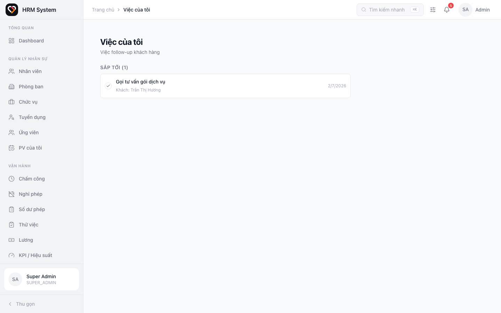

- Tạo việc từ tab **Việc cần làm** trên trang chi tiết khách hàng (đặt tiêu đề + hạn).
- Khi việc **tới hạn**, hệ thống tự gửi **thông báo** nhắc cho người được giao.
- Nhấn dấu **✓** để đánh dấu hoàn thành.

---

## 13. Gửi email cho khách hàng

Tại tab **Email** của trang chi tiết khách hàng, nhấn **Gửi email**:

- Chọn **mẫu email** có sẵn hoặc tự soạn tiêu đề + nội dung.
- Hỗ trợ biến cá nhân hóa: `{{customerName}}` (tên khách), `{{ownerName}}` (tên người phụ trách).
- Email gửi qua hệ thống (Resend); trạng thái: *Đang gửi → Đã gửi / Thất bại*. Toàn bộ lịch sử lưu tại tab Email.

> Khách hàng phải có địa chỉ email thì mới gửi được.

---

## 14. Cấu hình (Cài đặt bán hàng)

Vào **Cài đặt bán hàng** (nhóm Hệ thống — cần quyền cấu hình) để tùy chỉnh:

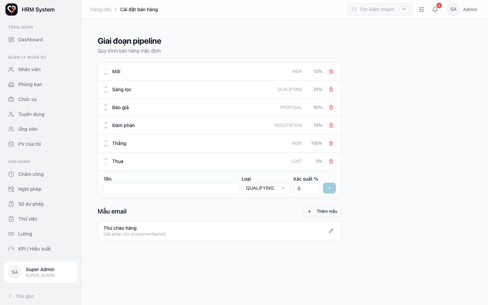

- **Giai đoạn pipeline:** thêm/sửa/xóa, đổi thứ tự (mũi tên ▲▼), đặt **xác suất %** cho mỗi giai đoạn (dùng cho dự báo).
  - Giai đoạn đã từng có cơ hội đi qua sẽ không xóa được (để bảo toàn lịch sử/báo cáo).
- **Mẫu email:** tạo và quản lý các mẫu email dùng lại khi gửi cho khách.

---

## 15. Phân quyền

Module phân quyền theo vai trò; quản trị viên gán vai trò cho nhân viên ở **Vai trò & quyền**.

| Vai trò | Phạm vi |
|---------|---------|
| **Nhân viên kinh doanh** (`SALES_REP`) | Chỉ thấy & quản lý khách hàng/cơ hội **của mình** + Lead Pool chưa ai nhận |
| **Trưởng nhóm kinh doanh** (`SALES_MANAGER`) | Thấy **toàn nhóm**, phân bổ lead, xem báo cáo team |
| **Quản trị / HR** | Toàn quyền cấu hình + xem toàn bộ |

> Nhân viên kinh doanh **không** có quyền phân công cho người khác và không thấy dữ liệu của đồng nghiệp.

---

*Mọi thắc mắc về hệ thống, liên hệ: support@codecrush.asia*
